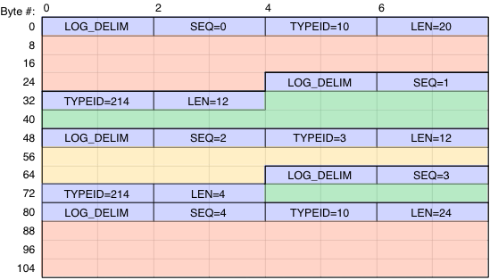

.. _wlan_exp_log:

.. include:: globals.rst

Event Log Tools
***************

The :mod:`wlan_exp_log` package provides utilities to process log data from 802.11 Reference
Design nodes.

The documentation here describes the Python framework for processing log data. For more details
on the reference design's logging system itself, please refer to the design's :ug:`user guide <wlan_exp/log>`.

Overview
========

The 802.11 Reference Design implements a logging framework which records any user-specified event in the nodes of an experimental network. The Reference Design implements many useful log entry types, including Tx packets, Rx packets and low-level MAC re-transmissions. Users can create additional entry types to suit their research application.

The basic flow for using log data in an experiments is:

#. Retrieve log data from one or more 802.11 Reference Design nodes
#. Generate an index of each node's log data
#. Filter the index to select the required subset of log entry types
#. Convert the log data and filtered index into structured arrays of log entries
#. Process the log entries to calculate the statistics required for the experiment

Log data retrieval (step 1) is implemented in the `wlan_exp_node.log_get_all_new()` method.

Log index generation and filtering (steps 2-3) and entry processing (steps 4-5) are described below.

Log Data
========

The term ``log_data`` refers to a `bytearray` of raw log data retrieved from an 802.11 Reference Design Node. The ``log_data`` is a tightly packed array of log entries, each composed of an entry header and arbitrary entry payload. The array of log data is a byte-for-byte copy of the log data retrieved
from the node's DRAM.

The log data format is documented in the :ug:`802.11 Reference Design user guide <wlan_exp/log>`.

In Python scripts log data is retrieved using the log methods implemented in `wlan_exp_node`.

Raw Log Index
=============

Log data can be quite large, often many gigabytes for a long trial. Re-parsing the full log data array to summarize its contents would be expensive. A more efficient approach is to generate an index describing the contents of each log data array at the time the array is retrieved, then save this index with the log data for easier processing in the future.

We call this index the **raw log index**. The raw log index contains the location of each log entry in the log data and the entry type ID of that entry.

For example, consider the log data array illustrated below.

	
	Example 112-byte log data array with 5 entries of 3 different entry types.

The blue areas show the log entry headers. Each header starts with a delimiter value, followed by a sequence number, the log entry type ID and the log entry length. Following the header is the log entry payload itself, illustrated as red, green and yellow here.

This log data contains 5 log entries of 3 distinct types:

* Two entries of type ID 10 (red) at byte offsets 8 and 88
* Two entries of type ID 214 (green) at byte offsets 36 and 76
* One entry of type ID 3 (yellow) at byte offset 56

The raw log index for this log data would be the dictionary::

	{10:  [8, 88],
	 214: [36, 76],
	 3:   [56]
	}

In actual experiments the log data and corresponding index will be **much** larger. We have successfully tested these tools on log data with tens of millions of entries (on a 64-bit machine, of course).

.. note::

	Notice that the dictionary keys are integer entry type IDs. This is by design, as it allows the raw log index to be generated using only the log data itself, with no dependence on the formats of the log entries themselves. The integer IDs will be translated into names in the log index filtering step, described below.

Tools
-----
The `log_util.gen_raw_log_index(log_data)` method will read a raw log data array and generate the log data index.

The `log_util_hdf.log_data_to_hdf5` method will optionally create and save the raw log index when saving log data to an HDF5 file.

The `log_util_hdf.hdf5_to_log_index` method will read a raw log index previously saved to an HDF5 file.

Archiving Log Data
==================
Log data retrieved from an 802.11 Reference Design node will initially be stored in RAM as a bytearray. In most experiments it is useful to write the log data to a file for archival and future processing.

We recommend storing log data in `HDF5 files <http://www.hdfgroup.org/HDF5/>`_ using the `h5py package <http://docs.h5py.org/en/latest/index.html>`_. The HDF5 format is open, fast, well documented and supported by a wide variety of tools.

HDF5 Log Data Format
--------------------

The HDF5 format is built from two types of objects:

* **Dataset** - an array of homogenous data with arbitrary dimensions
* **Group** - a named level of hierarchy which can contain datasets and other groups

Datasets and groups can also store **attributes**. Datasets and attributes retain their data types and dimensions when written to HDF5 files. The h5py package uses numpy arrays and datatypes as the Python interface to the underlying HDF5 data.

One important concept is the **root group**. Every HDF5 file has a root group named ``'/'``. Named datasets and groups can be added to the root group to build more complex hierarchy. Sub-groups have names, forming Unix-like paths to datasets and other groups, always starting with the root group ``'/'``.

The h5py package supports building HDF5 files with arbitrary hierarchy. We define a simple HDF5 hierarchy for storing 802.11 Reference Design log data in an HDF5 group. We call this group format a ``wlan_exp_log_data_container``. When an HDF5 group is used as a ``wlan_exp_log_data_container`` it must have the format illustrated below::

    wlan_exp_log_data_container (HDF5 group):
           |- Attributes:
           |      |- 'wlan_exp_log'         (1,)      bool
           |      |- 'wlan_exp_ver'         (3,)      uint32
           |      |- <user provided attributes>
           |- Datasets:
           |      |- 'log_data'             (1,)      voidN  (where N is the size of the data in bytes)
           |- Groups (optional):
                  |- 'raw_log_index'
                         |- Datasets: 
                            (dtype depends if largest offset in raw_log_index is < 2^32)
                                |- <int>    (N1,)     uint32/uint64
                                |- <int>    (N2,)     uint32/uint64
                                |- ...

The elements of this format are:

* ``wlan_exp_log`` attribute: must be present with boolean value True
* ``wlan_exp_ver`` attribute: 3-tuple of integers recording the `(major,minor,rev)` version of the wlan_exp package that wrote the file
* ``log_data`` dataset: the raw bytearray retrieved from the 802.11 Reference Design node, stored as a scalar value using the HDF5 opaque type
* ``raw_log_index`` sub-group (optional): if present, must be a group with one dataset per log entry type, where each dataset contains the array of integers indicating the location of each log entry in the ``log_data``. This group-of-datasets encodes the dictionary-of-arrays normally used to represent the raw_log_index.
* User provided attributes: additional attributes provided at the time of file creation. The `log_util_hdf` methods store these attributes when supplied by the user code. These can be useful to store additional experiment-specific details about the log data (i.e. date/time of the experiment, physical location of the nodes, etc.).

Writing Log Data Files
----------------------

The `log_data_to_hdf5(log_data, filename)` method will create an HDF5 file with name `filename` for the supplied `log_data` bytearray. This method will automatically generate and store a raw log index for the ``log_data``.

The `log_data_to_hdf5` method will create an HDF5 file with a single log_data array (i.e. with log data from a single node) stored in the root group.

Reading Log Data Files
----------------------

The `hdf5_to_log_data(filename)` method will read a ``log_data`` array from the HDF5 file named ``filename``. The format of the returned array is identical to the bytearray retrieved from an 802.11 Reference Design node and can be used wherever the original ``log_data`` array would have been used.

The `hdf5_to_log_index(filename)` method will read a raw log index from the HDF5 file named ``filename``. The dictionary returned will be identical to re-generating the index from scratch (i.e. by calling `log_util.gen_raw_log_index(hdf5_to_log_data(filename))`). Retrieving the raw index from an HDF5 file is typically must faster than re-generating the index from the log data.

Examples
--------

Filtered Log Indexes
====================

In most cases the log data retrieved from a node will contain entries that are not required for a particular analysis. User scripts can select a subset of entry types for further processing by filtering the raw log index, then passing the log data and filtered index to downstream tools for further parsing. Filtering the log index can be much faster than filtering the log data itself, especially for multi-gigabyte log data arrays.

Log index filtering is implemented in the `log_util.filter_log_index` method.

The `filter_log_index` method takes a raw log index, stored as a dictionary, as input and produces a new log index, also a dictionary. The method implements two processes:

* Translation of dictionary keys
* Selection of a subset of entry types to include in the output dictionary

Entry Type Translation
----------------------

Raw log indexes use integer entry type IDs as dictionary keys. These IDs are taken directly from the log data itself, which allows index generation even if the corresponding entry types are not understood by the wlan_exp Python code. But remembering these "magic" numbers is inconvenient when building analysis scripts.

The `filter_log_index` output dictionary uses entry type names as keys [#entry_type_names]_.

For example, assume the following log entry type definitions::

	ENTRY_TYPE_RX_OFDM = 10
	ENTRY_TYPE_RX_DSSS = 11
	ENTRY_TYPE_TX      = 20

	entry_rx_ofdm = WlanExpLogEntryType(name='RX_OFDM', entry_type_id=ENTRY_TYPE_RX_OFDM)
	entry_rx_dsss = WlanExpLogEntryType(name='RX_DSSS', entry_type_id=ENTRY_TYPE_RX_DSSS)
	entry_tx = WlanExpLogEntryType(name='TX', entry_type_id=ENTRY_TYPE_TX)

	#Entry type fields omitted for clarity - actual field definitions are required!

And a raw log index with multiple instances of each entry type::

	>>> my_raw_log_index
	{10: [7724, 8116, 8428, 9716],
	 11: [3572, 4468, 6900],
	 20: [144, 336, 528, 720, 912, 1104, 1296, 1488]}

Using the `filter_log_index` method to translate the entry type keys will give::

	>>>log_index = filter_log_index(my_raw_log_index)
	>>>log_index
	{RX_OFDM: [7724, 8116, 8428, 9716],
	 RX_DSSS: [3572, 4468, 6900],
	 TX: [144, 336, 528, 720, 912, 1104, 1296, 1488]}

Notice that the lists of log entry locations are unchanged, only the dictionary keys have been replaced. Now this index can be accessed by entry type name::

	>>>log_index['TX']
	[144, 336, 528, 720, 912, 1104, 1296, 1488]

.. [#entry_type_names] Technically, `filter_log_index` uses *instances* of the :ref:`WlanExpLogEntryType` class as keys in its output dictionary. The :ref:`WlanExpLogEntryType.__repr__` method returns the entry type name. The class itself overloads the `__eq__` and `__hash__` methods so an instance will "match" its name when the name is used to access a dictionary.

Entry Type Filtering
--------------------
The `log_util.filter_log_index` method has two additional arguments which are used to construct the output dictionary:

* `include_only`: List of entry type names to keep in output
* `exclude`: List of entry type names to exclude from output

The filter follows the a few basic rules:

#. If the `include_only` argument is present the `exclude` argument will be ignored
#. Every requested output key in the include_only argument will be present in the output dictionary, even if its list of log entry locations is empty
#. An instance of the :ref:`WlanExpLogEntryType` class must be previously created for each entry type included in the output

The following code snippets illustrate this include/exclude behavior::

	>>> my_raw_log_index
	{10: [7724, 8116, 8428, 9716],
	 11: [3572, 4468, 6900],
	 20: [144, 336, 528, 720, 912, 1104, 1296, 1488]}

	>>> log_index = filter_log_index(my_raw_log_index)
	>>> log_index
	{RX_OFDM: [7724, 8116, 8428, 9716],
	 RX_DSSS: [3572, 4468, 6900],
	 TX: [144, 336, 528, 720, 912, 1104, 1296, 1488]}

	>>> log_index = filter_log_index(my_raw_log_index, include_only=['TX', 'RX_OFDM'])
	>>> log_index
	{RX_OFDM: [7724, 8116, 8428, 9716],
	 TX: [144, 336, 528, 720, 912, 1104, 1296, 1488]}

	>>> log_index = filter_log_index(my_raw_log_index, exclude=['TX'])
	>>> log_index
	{RX_OFDM: [7724, 8116, 8428, 9716],
	 RX_DSSS: [3572, 4468, 6900]}

	>>> log_index = filter_log_index(my_raw_log_index, include_only=['TX', 'RX_OFDM', 'NODE_INFO'])
	>>> log_index
	{RX_OFDM: [7724, 8116, 8428, 9716],
	 TX: [144, 336, 528, 720, 912, 1104, 1296, 1488],
	 NODE_INFO: []}

Processing Log Data
===================

After log data is retrieved and the log index is generated, there are many possible tool flows to parse and process the log entries. A few recommended processing flows are described below and implemented in our examples. This is not an exhaustive or static list- this list will evolve as we and our users find new ways to use data produced by the 802.11 Reference Design logging framework.

NumPy Structured Arrays
-----------------------

The `NumPy package <http://www.numpy.org/>`_ provides many tools for processing large datasets. One very useful NumPy resource is `structured arrays <http://docs.scipy.org/doc/numpy/user/basics.rec.html#structured-arrays-and-record-arrays>`_.

The `wlan_exp_log.log_util.log_data_to_np_arrays(log_data, log_index)` method will process a log data array with its corresponding index and return a dictionary of NumPy structured arrays. The dictionary will have one key-value pair per log entry type in the `log_index` dictionary. Each dictionary value will be a NumPy structured array.

The names and data types of each field for a log entry type are defined by that type's WlanExpLogEntryType instance. The formats for log entry types implemented in the 802.11 Reference Design are defined in the `wlan_exp_log.log_entries` module.

